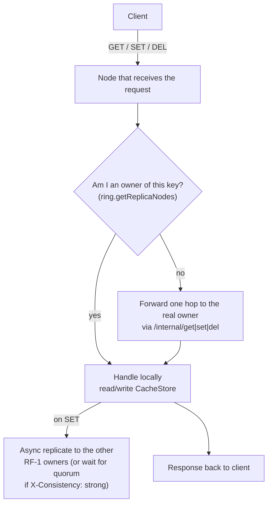
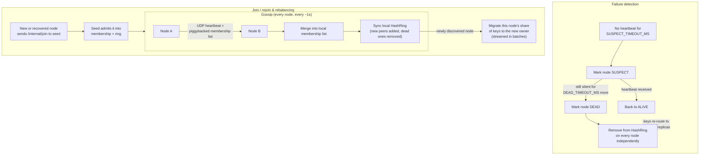

# How to Run This Project

A self-contained guide to get the self-healing distributed cache running on
your own machine, from a clean clone to killing a node and watching the
cluster survive it. No prior context needed.

## 1. What this is

A Redis-like cache cluster built from scratch: multiple independent Node.js
processes ("nodes") that together form one logical cache. Keys are
distributed with consistent hashing, replicated across nodes, and
automatically rerouted around a node that dies — all detected via a gossip
protocol, with no central coordinator.

## 2. Prerequisites

- **Node.js v20 or later** — check with `node -v`
- **npm** (comes with Node)
- Works on Windows, macOS, and Linux. All scripts here use cross-platform
  tools (no bash-only `kill -9` or shell scripts required).

## 3. Get the code and install dependencies

```bash
git clone https://github.com/dipakshinde-art/self-healing-distributed-chche.git
cd self-healing-distributed-chche
npm install
```

## 4. Configuration — what data/env vars it needs

Copy the example env file:

```bash
cp .env.example .env
```

`npm run start:cluster` (used below) already sets the per-node variables
for you via npm scripts, so **you don't need to hand-edit `.env` to run the
default 3-node demo**. The `.env` file matters only if you run a single
node directly (`npm run dev:node`) or want to change cluster-wide defaults
(timeouts, replication factor, eviction policy, etc.).

| Variable | Default | What it controls |
|---|---|---|
| `NODE_ID` | `node-1` | This node's unique identifier |
| `NODE_HOST` | `127.0.0.1` | Host this node binds to |
| `NODE_PORT` | `3001` | Client-facing HTTP port |
| `NODE_GOSSIP_PORT` | `4001` | UDP port used for gossip heartbeats |
| `SEED_HOST` / `SEED_PORT` | `127.0.0.1` / `3001` | Address of the seed node this node joins through |
| `REPLICATION_FACTOR` | `2` | Number of nodes each key is stored on (RF) |
| `VNODE_COUNT` | `150` | Virtual nodes per physical node on the hash ring |
| `SUSPECT_TIMEOUT_MS` | `3000` | No heartbeat for this long → node marked `SUSPECT` |
| `DEAD_TIMEOUT_MS` | `6000` | No heartbeat for this long → node marked `DEAD` and removed from the ring |
| `GOSSIP_INTERVAL_MS` | `1000` | How often a node sends heartbeats |
| `GOSSIP_FANOUT` | `3` | How many random peers each gossip round targets |
| `TTL_SWEEP_INTERVAL_MS` | `5000` | Background sweep interval that purges expired keys |
| `EVICTION_POLICY` | `none` | `none` \| `lru` \| `lfu` — memory-pressure eviction strategy |
| `EVICTION_THRESHOLD_MB` | `256` | Estimated memory usage that triggers eviction |
| `EVICTION_SWEEP_INTERVAL_MS` | `5000` | How often the eviction sweep runs |
| `MAX_RETRIES` | `1` | Client-side retry count on a failed request |
| `RETRY_DELAY_MS` | `50` | Delay before that retry |
| `LOG_LEVEL` | `info` | `debug` \| `info` \| `warn` \| `error` |
| `FORWARD_TIMEOUT_MS` | `1500` | How long a node waits for the real key owner before trying the next replica |

No database, API key, or external service is required — everything is
in-memory and local to your machine.

## 5. Run a single node (optional sanity check)

```bash
npm run dev:node
```

```bash
curl -X POST http://localhost:3001/set -H "Content-Type: application/json" -d '{"key":"hello","value":"world"}'
curl http://localhost:3001/get/hello
```

## 6. Run the real 3-node cluster

```bash
npm run start:cluster
```

This spawns `node-1` (seed, port 3001), `node-2` (port 3002), and `node-3`
(port 3003) concurrently, each with its own HTTP + gossip port. Give it a
couple of seconds to finish joining, then check:

```bash
curl http://localhost:3001/health
curl http://localhost:3002/health
curl http://localhost:3003/health
```

### Prove any node is a correct entry point

Set a key on one node, read it back from all three — this is the core
mechanism: every node forwards to the real owner if it isn't one itself.

```bash
curl -X POST http://localhost:3002/set -H "Content-Type: application/json" -d '{"key":"foo","value":"bar"}'
curl http://localhost:3001/get/foo   # -> bar
curl http://localhost:3002/get/foo   # -> bar
curl http://localhost:3003/get/foo   # -> bar
```

### Check live cluster status

```bash
curl http://localhost:3001/status
# or, with the CLI:
npm run cli -- status --port 3001
```

### Delete a key

```bash
curl -X DELETE http://localhost:3001/del/foo
```

### Strong-consistency (quorum) write

```bash
curl -X POST http://localhost:3001/set \
  -H "Content-Type: application/json" -H "X-Consistency: strong" \
  -d '{"key":"q","value":"1"}'
```
This blocks until `RF/2 + 1` nodes have acknowledged the write, instead of
returning immediately and replicating in the background (the default).

## 7. Run the automated test suite

```bash
npm test               # all unit, integration, and stress tests
npm run test:watch     # watch mode
npm run test:coverage  # with a coverage report
```

## 8. The main demo: survive a live node kill

This is the project's core proof-of-concept — kill a random node mid-traffic
and confirm zero client requests fail (beyond one automatic retry).

```bash
npm run start:cluster   # terminal 1
npm run load-test       # terminal 2 — real SET/GET traffic that verifies values, not just HTTP 200
```

While the load test is running, in a third terminal:

```bash
npm run kill-node                       # kills a random live node
npm run kill-node -- --node-id node-2   # or target a specific one
```

The load test prints a final report:

```
=== LOAD TEST RESULTS ===
Total requests:   ...
Failed requests:  0
Retries:          ...
Latency p50:      ...ms
Latency p99:      ...ms
```

`Failed requests: 0` is the number that matters — it means every request
eventually got the right answer even with a node down. (With only 3 nodes,
killing 1 is a third of the cluster, so the retry percentage will run
higher than it would in a larger deployment — that's expected, not a bug.)

The cluster is Windows/macOS/Linux-safe throughout: `kill-node.ts` kills a
process by its PID file rather than shelling out to `kill -9`.

## 9. Troubleshooting tips

- **Port already in use**: a previous cluster run may still have processes
  alive. Check `.pids/*.pid` for stale PIDs, or just pick different ports
  in `.env`.
- **A node won't join**: make sure the seed (`node-1` / port 3001 by
  default) is started — every other node retries joining it for a while,
  but will eventually give up if it never comes up.
- **Stale `.pids/` entries after a hard kill**: harmless — `kill-node.ts`
  checks whether a PID is actually alive before targeting it.
- **`npm run test:coverage` fails on a fresh checkout**: it shouldn't — the
  repo maintains a 70% branch-coverage floor via `jest.config.js`. If you
  add new source files without tests, this is the gate that will catch it.

## 10. How it works (architecture)

### Request routing

Every node keeps its own view of the hash ring (kept in sync via gossip).
When a client hits *any* node, that node checks whether it's a legitimate
owner of the key; if not, it forwards the request exactly one hop to a node
that is.



### Failure detection and self-healing



### Why any node can answer any request

- **Ring stays consistent everywhere**: a node's ring updates not just when
  it directly joins another node, but whenever gossip tells it about a peer
  it didn't know about — so all nodes converge to the same view, not just
  the ones that talked to each other directly.
- **Reads check locally first, then walk owners**: if the node you hit
  doesn't have the key locally, it tries the other legitimate owners in
  ring order — a clean 404 from one owner doesn't stop the search, since
  that owner might simply be mid-migration.
- **Writes always land on a real owner**: a node that isn't an owner never
  stores a key itself; it forwards the write to whoever legitimately owns
  it, which is what replication then fans out to the other `RF-1` owners.

See [docs/SYSTEM_DESIGN.md](docs/SYSTEM_DESIGN.md) for the deeper design
write-up, including known trade-offs and open gaps.
